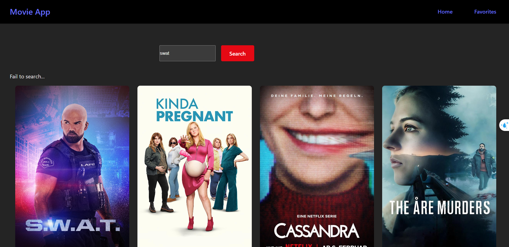
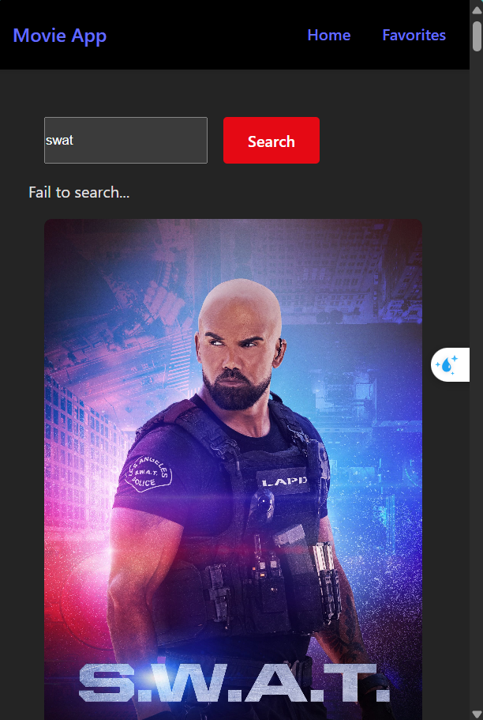

# React + Vite

This template provides a minimal setup to get React working in Vite with HMR and some ESLint rules.

Currently, two official plugins are available:

- [@vitejs/plugin-react](https://github.com/vitejs/vite-plugin-react/blob/main/packages/plugin-react/README.md) uses [Babel](https://babeljs.io/) for Fast Refresh
- [@vitejs/plugin-react-swc](https://github.com/vitejs/vite-plugin-react-swc) uses [SWC](https://swc.rs/) for Fast Refresh

## Project Overview

This project is a React application bootstrapped with Vite. It includes hot module replacement (HMR) and ESLint configurations to help you write clean and maintainable code.

## Getting Started

To get started with this project, follow these steps:

1. **Clone the repository:**
    ```sh
    git clone https://github.com/your-username/your-repo-name.git
    cd your-repo-name
    ```

2. **Install dependencies:**
    ```sh
    npm install
    ```

3. **Run the development server:**
    ```sh
    npm run dev
    ```

4. **Build for production:**
    ```sh
    npm run build
    ```

5. **Preview the production build:**
    ```sh
    npm run serve
    ```

## Folder Structure

```
/public
  /images
     - example1.png
     - example2.png
/src
  /components
  /pages
  /styles
  App.jsx
  main.jsx
```

## Screenshots

Here are some screenshots of the application showcasing various features:

### Home Movie
The home page displays a list of movies fetched from the API.


### Favorite Hover
Hovering over a movie allows you to add it to your favorites.


### Responsive Design
The website is fully responsive and adapts to different screen sizes.


### Favorite Page
The favorite page lists all the movies you have marked as favorites.


## Contributing

If you would like to contribute to this project, please follow these steps:

1. Fork the repository.
2. Create a new branch (`git checkout -b feature-branch`).
3. Make your changes.
4. Commit your changes (`git commit -m 'Add some feature'`).
5. Push to the branch (`git push origin feature-branch`).
6. Open a pull request.

## License

This project is licensed under the MIT License. See the [LICENSE](LICENSE) file for more information.

## Acknowledgements

- [Vite](https://vitejs.dev/)
- [React](https://reactjs.org/)
- [Babel](https://babeljs.io/)
- [SWC](https://swc.rs/)

Thank you for checking out this project!
